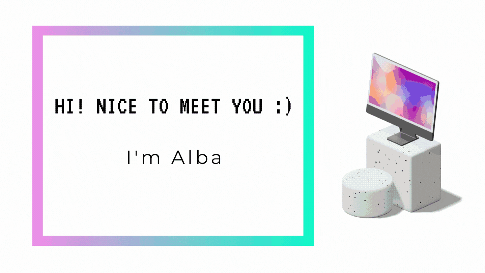

# Hi, I'm Alba
A frontend developer from Barcelona (yasss i'm lucky to live next to the beach). I love Dracula, collect toys, vintage adventure games as Day of the Tentacle and i'll always say yes to a Red Velvet.
I’m currently working on my portfolio and planning some personal projects. I love teamwork so collab requests are welcome 🖤

### Connect with me:

   

### Languages and Tools:
        

  

